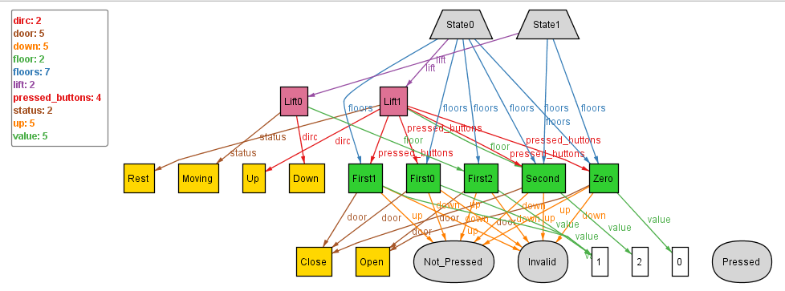
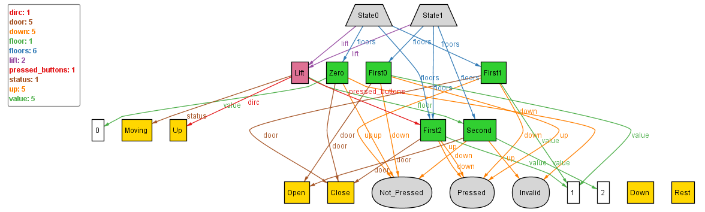

## Tackling NEEDTOFIX-2

As stated in the version-8 of One_Lift, we need to constrain that the pressed_buttons inside a lift can only point to floors which are mapped with the parent state 
(NEEDTOFIX-2) i.e. state.lift => ( all p : state.lift.pressed_buttons | p in state.floors )  

For this we can simply add a fact constraining the pressed_buttons of a lift to be such :
```
	all s: State | (all p: s.lift.pressed_buttons | p in s.floors)
```

Upon executing with run command - `run{} for 2 State, 2 Lift, exactly 5 Floor`, we get:



This solves the problem NEEDTOFIX-2, however, we can notice another problem here, which we missed earlier (possibly as we didn't check after implementing 2 states), that the Invalid is being pointed by multiple floor buttons, even the ones which should be pressable.

**Probable cause:** When we use the below snippet for invalidating and rejecting, the ones for rejecting invalidation, are implicitly only constraining atleast one such Bottom_Floor, Middle_Floor, Top_Floor to follow them, and thereby causing this problem, when multiple states of a type of floor are present.
```
// Original Snippet:
	// Invalidating the floor buttons
	Top_Floor.up = Invalid
	Bottom_Floor.down = Invalid
	
	// Adding constraints for the floor buttons which should always be pressable
	Middle_Floor.up != Invalid
	Middle_Floor.down != Invalid
	Top_Floor.down != Invalid
	Bottom_Floor.up != Invalid
```

**Solution:** we shall explicitly invalidate and reject invalidation, via:
```
	// Invalidating the floor buttons
	all t: Top_Floor| t.up = Invalid
	all b: Bottom_Floor| b.down = Invalid
	
	// Adding constraints for the floor buttons which should always be pressable
	all m: Middle_Floor| m.up != Invalid
	all m: Middle_Floor| m.down != Invalid
	all t: Top_Floor| t.down != Invalid
	all b: Bottom_Floor| b.up != Invalid
```
Upon, re-executing, the instances we get are:


Indicating consistency, hence, we have tackled the NEEDTOFIX-2 and another problem we encountered with Invalidating along the way.
