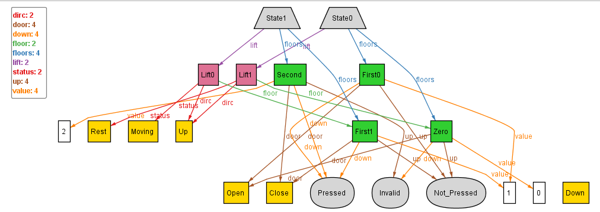

## Tackling NEEDTOFIX-3

As stated in the version-8 of the One_Lift modelling, we need to constrain that, the floor at which any lift is, must exist within the floors being pointed to by all the parents (States) of the lift (NEEDTOFIX-3).

This would be easier to think and model if we think from the State perspective, i.e. for all States, the State.lift.floor must be in State.floors.

For this we can simply add a fact constraining this :
```
	all s: State | (s.lift.floor in s.floors)
```

Upon executing with run command - `run{} for 1 State, 1 Lift, exactly 4 Floor`, we get:



This seems consistent with what we wanted, hence, we are done with the NEEDTOFIXs.

Now, can go back to tackling the problem of floors set mapped to a state being complete and independent.
