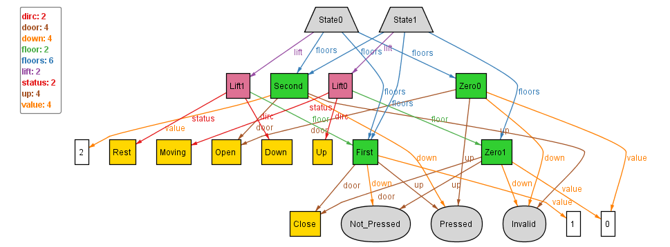
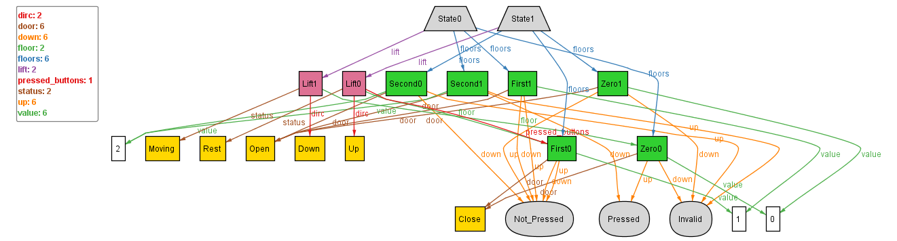
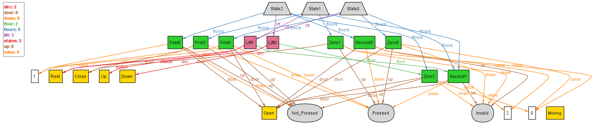
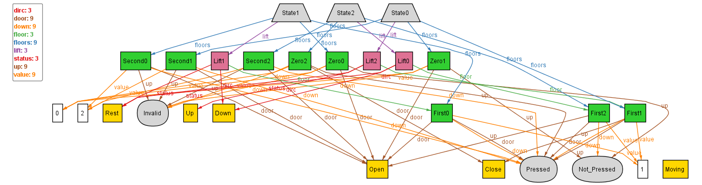

## Tackling problems - continued... State.floors should be complete and independent

To tackle this problem, we had added previously the below constraint to:
- fix the size of state.floors to 3
- ensure that each floor instance is included within this set
```
    all s: State | #s.floors = 3 and
    some f1:Zero | f1 in s.floors and
    some f2:First | f2 in s.floors and
    some f3:Second | f3 in s.floors
```
However, had commented that part due to speculations of incorrectness as in the observed instances all the States pointed to the same 3 floors for their State.floors set.
Additionally, there were a bunch of problems observed, which needed to be fixed first, hence, had proceeded forward, leaving this part to be dealt with later. <br>
Now, we shall un-comment the snippet and try to execute it multiple times, to check:

1. <p>
```
run{} for 1 State, 1 Lift, exactly 4 Floor
```
No Instance, as a State can have max 3 Floors</p>
2. <p>
```
run{} for 2 State, 1 Lift, exactly 4 Floor
```
 <br>
The above seems consistent with what we wanted. </p>

3. <p>
```
run{} for 2 State, 2 Lift, exactly 4 Floor
```
 <br>
The above seems consistent with what we wanted. </p> 

4. <p>
```
run{} for 2 State, 2 Lift, exactly 6 Floor
```
 <br>
The above seems consistent with what we wanted. </p> 

5. <p>
```
run{} for 3 State, 3 Lift, exactly 9 Floor
```
 <br>
The above seems consistent with what we wanted. </p> 

### Conclusion:
We can conclude that our uptil now, is consistent with what we wanted our lift to be, the states it can be in, and even for the ordering aspect. <br>
Now, we shall work upon the dynamic aspect of the lift, and how it can move adding one movement at a time, starting with basic constraints.
