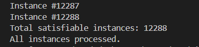

## Static Lift Completion - Verification

So, uptil here, we had step-by-step discussed, builded and debugged the features of a lift, including adding ordering in between the states.

Now, before we move to the dynamic aspects of lift, we shall want to verify that the lift is behaving as we intended. For this, one might want to count the number of
satisfiable instances and compare it with what the number must be logically. If both are the same for multiple conditions, one may say that the modelling of a static 
lift is completed.

However, neither Alloy, nor the analyzer supports this functionality (until now) to give the number of satisfiable instances. After much deliberation I decided to write a script in java to run the .jar file of Alloy analyzer iteratively, this can be found [AlloyInstanceCounter.java](./AlloyInstanceCounter.java).
<br> Then I used the commands to compile, and subsequently run the files:
```
javac -cp .:alloy4.2_2015-02-22.jar AlloyInstanceCounter.java
java -cp .:alloy4.2_2015-02-22.jar AlloyInstanceCounter
```

Now, we shall run this for multiple conditions:

1. `run{} for 1 State, 1 Lift, 3 Floor` <br>
   Logically,
   - state: shall have the lift, the 3 floors (1) - 1
   - lift: can be on any one of the 3 floors (3), also the pressed_buttons can be any subset of the 3 floors (2^3 = 8), can have one of the two dirc (2), one of the two status (2) - 3\*8\*2\*2 = 96
   - floors: each floor can have the door open or closed (2^3 = 8), have two dircn of functioning buttons with pressed, not_pressed (however, only 4 buttons working = 2^4 = 16) - 8\*16 = 128
   Hence, the no. of possible instances logically are = 1\*96\*128 = 12288
   And upon running the script, we get:<br>
   <br>
   We can see that implemented instances (12288) = logical instances (12288)
     
2. `run{} for exactly 2 State, exactly 1 Lift, exactly 3 Floor` <br>
   Logically,
   - state: shall have the lift, the 3 floors (1) - 1
   - lift: can be on any one of the 3 floors (3), also the pressed_buttons can be any subset of the 3 floors (2^3 = 8), can have one of the two dirc (2), one of the two status (2) - 3\*8\*2\*2 = 96 
   - floors: each floor can have the door open or closed (2^3 = 8), have two dircn of functioning buttons with pressed, not_pressed (however, only 4 buttons working = 2^4 = 16) - 8\*16 = 128
   Hence, the no. of possible instances logically are = 1\*96\*128 = 12288
   And upon running the script, we get:<br>
   <br>
   We can see that implemented instances (12288) = logical instances (12288)

Thereby, we can conclude that the static states modelling of the lift is complete.
 
