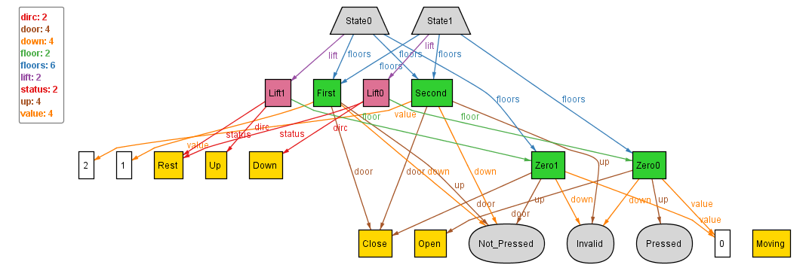

## Dynamics - initialising first State

We start the dynamic modelling of the system by defining the first State of the model.
This is done via using the attribute _"first"_ and adding new kind of facts called first{}:

```
fact first {
	// Initialising that the lifts in the first State with zeroth floor, no pressed_buttons,
	first.lift.floor in Zero
	no first.lift.pressed_buttons
	first.lift.status = Rest
	first.lift.dirc = Up
	// Initialising the floors with doors closed, buttons invalidated/Not_pressed
	all f: first.floors | f.door = Close and
	(( f.up != Invalid) => (f.up = Not_Pressed)) and 
	(( f.down != Invalid) => (f.down = Not_Pressed))
}
```

Using these we initialise the Lifts to be at the zeroth floor, at rest, with no buttons pressed. Also, the floors are initialised with doors closed, and all the 
pressable buttons to be at the Not_Pressed state. <br>
Upon executing we get instances of the form:



Looking at the above image, we can clearly say, that the first state carries all the properties we intended and has been initialised.
