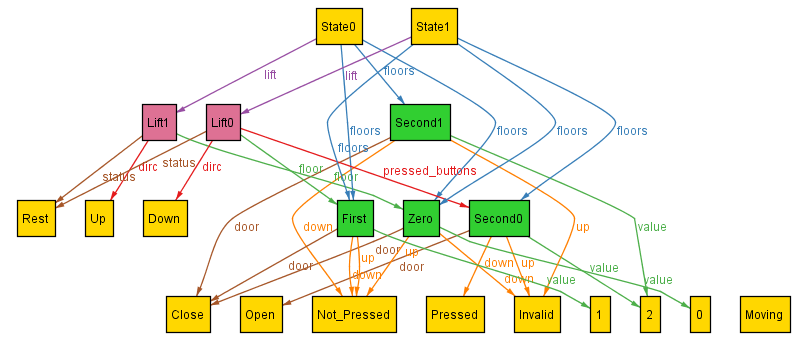
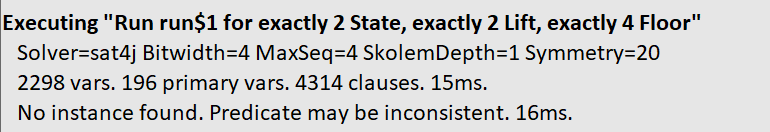
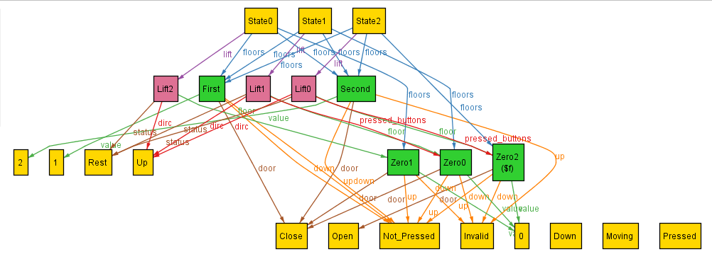

## Dynamics - Opening Door

In this I try to implement the dynamics of opening of door, building upon previous implementation.
As discussed, I specify the movement and then imply the scenario which must be met for the movement to occur.

Keeping this in mind, I note down the pseudocode of criterias which must be met:
```
if ( s.lift.floor.door = Open and s1.lift.floor.door = Close ):
  - ensure lift is at rest and moves to the same direction as before and after opening of door
  - either the floor should be within the pressed_buttons or the floor up/down button should be pressed
  - the s.lift.floor should essentially remain the same, except for the door
  - must update only this floor linked with the state 
```

Upon modelling this as can be seen in [old_Lift.als](old_Lift.als), and running the analyzer for satisfiable instance I get:



On analyzing this instance, one can notice that in the next state (state1), the doors of Second open, whereas, this shouldn't be happening as the lift isn't on this floor. Looking back at the psuedocode, I realise that, I had only constrained opening of door for the floor on which the lift is and missed the rest of the floors.

Now, I modify the prev, to constrain the opening of doors to only if the lift is at the given floor, as can be found in [old_Lift2.als](old_Lift2.als).

```
    // here s1 = s.next
    all f, f1: Floor | 
    ( f in s.floors ) and ( f1 in s1.floors ) and
    ( f.value = f1.value ) and
    (( not ( s.lift.floor = f and s1.lift.floor = f1 )) =>
    ( f.door = Close and f1.door = Close ))
```

Upon implementing and running this I get, 


On analyzing, I realize that I had wrongly constrained that for any two floors which exist in both s and s.next to have the same values. This is wrong, as we wanted to constrain that for two such floors in s and s.next which had the same value to have the doors closed if the lift isn't at their floor. So to do this, we use implication:
```
    // here s1 = s.next
    all f, f1: Floor | 
    (( f in s.floors ) and ( f1 in s1.floors ) and
    ( f.value = f1.value )) =>
    (( not ( s.lift.floor = f and s1.lift.floor = f1 )) =>
    ( f.door = Close and f1.door = Close ))
```

However, I further modify this, as here our motive is to simply constrain door opening and restrict it to the scenario wherein the lift is at the designated floor. I do this by:
```
    all f: s.floors, f1: s1.floors | 
		( f.door = Close and f1.door = Open and f.value = f1.value) =>
		( s.lift.floor = f and s1.lift.floor = f1 )
```
This gives us the kind of satisfiable instances which we were looking for:



We can see in the above instance we have the 3rd State having an Open door for the Zeroth floor, only possible as the lift was on Zeroth floor and the pressed_buttons had it. Hence, we have achieved this movement.
