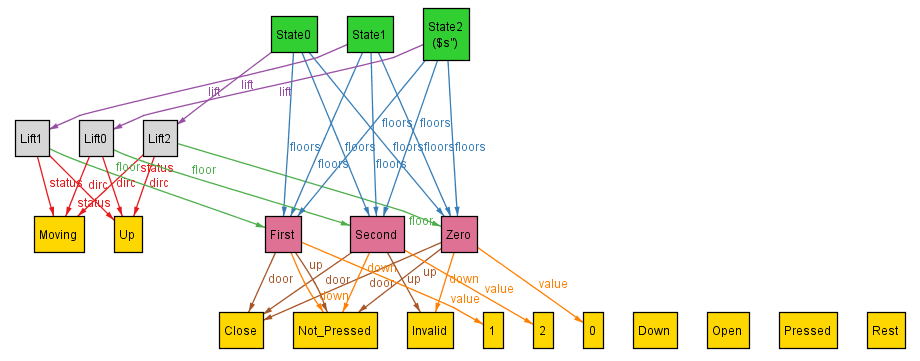

## Dynamics - Moving Up

My focus is now to implement and constrain the upward movement of the lift.

For this, I again list down the circumstance which I have to constrain and in which circumstance I want the lift to go up:

```
// s: State, s1: s.next 
if s.lift.floor.value < s1.lift.floor.value:
    - s1.lift.floor.value = s.lift.floor.value + 1
    - s.lift.dirc remains same and as Up
    - s.lift.status remains same and as Moving
    - the pressed_buttons of the lift remain unchanged
    - s.floors = s1.floors
```

I did this, as I wanted to constrain the movement of the lift to one floor up at a time.

Also, in order to check the upward movement, I introduce the statement:
```
    some s: State | s.lift.floor in Second
```
and run the analyzer for `exactly 3 State, exactly 3 Lift, exactly 3 Floor`.

When I introduce the new constrain as:

```
fact up {
    // specifying the case for the lift moving up
    all s: State - last, s1: s.next {
        // constraining that the next floor if has higher value than the current floor 
        // then can go at max one floor up, as well as the motion is maintained
        ( s.lift.floor.value < s1.lift.floor.value ) =>
        {
            s1.lift.floor.value = s.lift.floor.value + 1
            s.lift.dirc = Up and s1.lift.dirc = Up
            s.lift.status = Moving and s1.lift.status = Moving
            s1.lift.pressed_buttons = s.lift.pressed_buttons
            s1.floors = s.floors
        }
    }
}
```
 I get no satisfiable instances, hence, after analyzing for errors I realize that somehow `s1.lift.floor.value = s.lift.floor.value + 1` is constraining the statement a bit too much, too loosen it, yet maintaining the constraints, I use:
 ```
fact up {
    // specifying the case for the lift moving up
    all s: State - last, s1: s.next {
        // constraining that the next floor if has higher value than the current floor 
        // then can go at max one floor up, as well as the motion is maintained
        ( s.lift.floor.value < s1.lift.floor.value ) =>
        {
            s1.lift.floor.value < s.lift.floor.value + 2
            s.lift.dirc = Up and s1.lift.dirc = Up
            s.lift.status = Moving and s1.lift.status = Moving
            s1.lift.pressed_buttons = s.lift.pressed_buttons
            s1.floors = s.floors
        }
    }
}
```

which works, and gives satisfiable instances such as this:



Hence, now our lift can move up, next we'll work upon downward movement.
