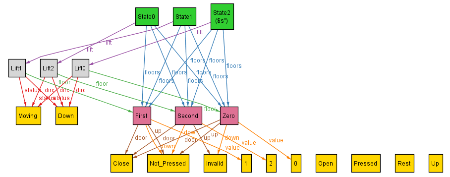

## Dynamics - Moving Down

My focus is now to implement and constrain the downward movement of the lift.

For this, I list down the circumstance which I have to constrain and in which circumstance I want the lift to go down:

```
// s: State, s1: s.next 
if s.lift.floor.value > s1.lift.floor.value:
    - s1.lift.floor.value > s.lift.floor.value - 2
    - s.lift.dirc remains same and as Down
    - s.lift.status remains same and as Moving
    - the pressed_buttons of the lift remain unchanged
    - s.floors = s1.floors
```

I did this, as I want to constrain the movement of the lift to one floor down at a time (learning from the upward motion).

Also, in order to check the downward movement, I introduce the statement:
```
    first.lift.dirc = Down
    first.lift.floor in Second
    some s: State | s.lift.floor in Zero
```
and run the analyzer for `exactly 3 State, exactly 3 Lift, exactly 3 Floor`.

Now, I introduce the new constrain as:

```
fact down {
    // specifying the case for the lift moving down
    all s: State - last, s1: s.next {
        // constraining that the next floor if has lower value than the current floor 
        // then can go at max one floor down, as well as the motion is maintained
        ( s.lift.floor.value > s1.lift.floor.value ) =>
        {
            s1.lift.floor.value > s.lift.floor.value - 2
            s.lift.dirc = Down and s1.lift.dirc = Down
            s.lift.status = Moving and s1.lift.status = Moving
            s1.lift.pressed_buttons = s.lift.pressed_buttons
            s1.floors = s.floors
        }
    }
}
```
However, I get no satisfiable instances, hence, after analyzing for errors I realize that somehow `s1.lift.floor.value > s.lift.floor.value - 2` isn't working correctly. This makes me think maybe Alloy isn't able to compare negative values with positive ones or something like that. So, I change the relation to:
 ```
fact down {
    // specifying the case for the lift moving down
    all s: State - last, s1: s.next {
        // constraining that the next floor if has lower value than the current floor 
        // then can go at max one floor down, as well as the motion is maintained
        ( s.lift.floor.value > s1.lift.floor.value ) =>
        {
            s1.lift.floor.value + 2 > s.lift.floor.value
            s.lift.dirc = Down and s1.lift.dirc = Down
            s.lift.status = Moving and s1.lift.status = Moving
            s1.lift.pressed_buttons = s.lift.pressed_buttons
            s1.floors = s.floors
        }
    }
}
```

which works (strengthening my reasoning), and gives satisfiable instances such as this:



Hence, now our lift can also move down.

