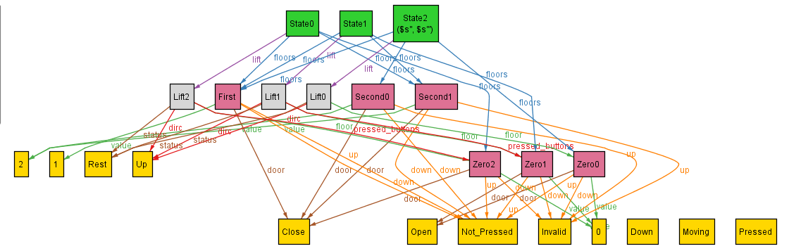
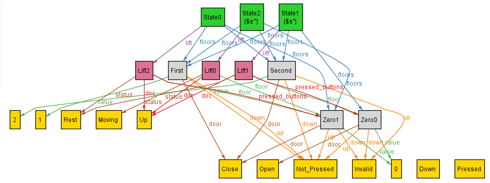
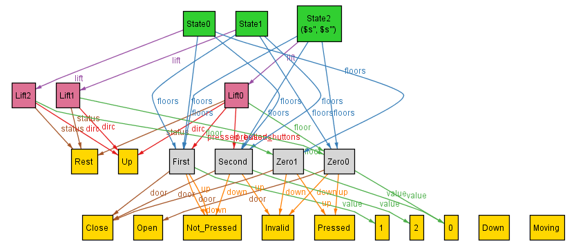

## Dynamics - Closing Door, constraining Pressed_Buttons

In this I try to implement the dynamics of closing of door, building upon previous implementation.
As discussed, I specify the movement and then imply the scenario which must be met for the movement to occur.

Keeping this in mind, I note down the pseudocode of criterias which must be met:
```
if ( s.lift.floor.door = Open and s1.lift.floor.door = Close ):
  - ensure lift is at rest and moves in the direction accordingly (for now, looking to implement basic sweep)
  - either the floor should be within the pressed_buttons or the floor up/down button should be pressed
  - if the floor was within pressed_buttons of the lift then must be removed
  - and/or if the button in the dirc of the lift was pressed then it must be unpressed after
  - rest of the s.lift.floor should essentially remain the same, except for the door
  - must update only this floor linked with the state 
```

Upon modelling using the design of Opening of door, and modifying this to be able to check the condition of door closing we add:
```
    one z: Zero | z = first.lift.pressed_buttons
    some s: State | s.lift.floor.door = Open
    some s: State | no s.lift.pressed_buttons 
```
as can be seen in [old_Lift.als](old_Lift.als). This makes the first state at ground floor at rest, with Zeroth floor as pressed and ensures that there exists a state with some open door and some without any pressed_buttons, thus, checking if the door closed and the floor was removed successfully. Now, upon running the analyzer for satisfiable instance I get:



This shows that the pressed_buttons get removed without any change in the state of door. Looking at this we can realize that this happened as I hadn't constrained the pressed_buttons yet, for a floor to get removed only when a transition from open door to close occurs as well.

Hence, now, we add constrains for the pressed_buttons:
```
// s1 = s.next
if s1.lift.pressed_buttons is a strict subset of s.lift.pressed_buttons:
    // implies that some lift got removed from it, hence, only possible if the door have just closed back again
    s1.lift.floor.door = Close and s.lift.floor.door = Open
elif s.lift.pressed_buttons is a strict subset of s1.lift.pressed_buttons:
    // implies that someone walked in and pressed some floors, we make a few assumption:
    // - this can only happen when someone has just walked in
    // - someone only walks in when the lift opened due to buttons on the floor being pressed
    s.lift = s1.lift (except for pressed_buttons) and s.lift.floor.door = Open and
    (if s.lift.dirc = Up => s.lift.floor.up = Pressed, else s.lift.floor.down = Pressed)
elif s.lift.pressed_buttons and s1.lift.pressed_buttons are incomparable:
    // shouldn't happen ever, as we either add or remove pressed_buttons
    not (s.lift.pressed_buttons and s1.lift.pressed_buttons are not subset of each other)
```

Upon implementing the same in Alloy analyzer and running, we get _no satisfiable instances_. <br>
Thus, I reiterate through the logic, now realising that the scenario of them being incomparable can happen, as when the door opens on a floor, we map the pressed_buttons to a new similar floor state with the door open. This causes the pressed_buttons to essentially be same and yet different and incomparable. Hence, I modify the condition as:
```
elif s.lift.pressed_buttons and s1.lift.pressed_buttons are incomparable:
    // can only happen when the door opens and the floor state is reassigned a new one
    s.lift.floor.door = Close and s1.lift.floor.door = Open
``` 

After implementing [Lift.als](Lift.als) when we run this we get:



We can see that initially the Zero was present in pressed_buttons hence, the lift opened, then Zeroth got removed from pressed_buttons (State 2) and the lift has closed. Additionally, I cross-run tests to check validity of the working of pressed_buttons other constrain, of a floor being able to get pressed. <br>
Adding conditions that Second must be in the pressed_buttons of some state, we get:



Hence, cross-verifying the code. Thus, we are good to move forward and can assume that door closing and the pressed_buttons have been constrained successfully

