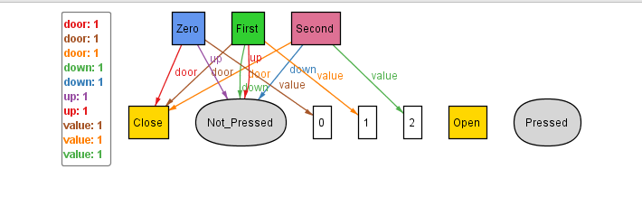

## Initialising the Basic Floor Sig

Here, we shall be starting the first implementation with a 3-Floor Lift Basic Mechanism.

Now, initialised the basic Floor signatures. since, there are three type of floors:
- Top: only down button exists
- Bottom: only up button exists
- Middle: both button exists
Additionally, each type of floor would have a lift door and value (for ordering). 

Implementing the three abstract sigs Top_Floor, Middle_Floor, Bottom_Floor and extending them for Zero, First and Second respectively (3-Lift system) in alloy and executing we get:

  

**Problem:**

Upon analyzing the above satisfiable instance, we can realise that we would have to treat the floors (the 3-types) seperately everywhere, and won't be
able to generalise the logical statements which we want to write for a floor in general with regard to it's movement.
This is such as the Top_Floor, Middle_Floor and Bottom_Floor are independent abstractions.
