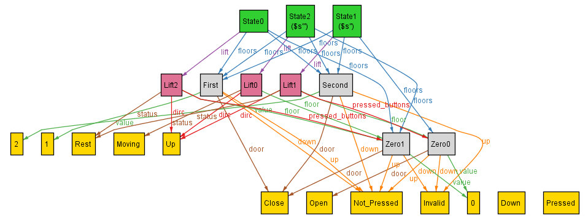

## Dynamics - Lift Status : Moving/Rest

Now that we have seen the basic dynamics of the lift, we shall talk about constraining finer aspects, which may be missed out.

I start with the status of the lift - Moving/Rest. Right now, this transition is free. However, we would want that the lift:

- transitions to the Rest state only at the same time lift door opens
- transitions to the Moving State only after the door closes
- Additionally, we would want that if the floor is within the pressed_buttons or the floor button is pressed in the dircn of the lift, then the lift must come to the Rest state

For these I must make a few amends, firstly, modify the fact open_door a bit, by removing `s.lift.status = Rest` as we now, directly want the lift to transition from to Rest state with door open, irrespective of the initial status (Moving/Rest).

Secondly, I would need to add a few constraints:
```
if ( s.lift.status = Moving and s1.lift.status = Rest ):
    // to ensure this happens along with opening of door
    - s.lift.floor.door = Close and s1.lift.floor.door = Open
if ( s.lift.status = Rest and s1.lift.status = Moving ):
    // to ensure this happens only after door closes 
    - s.lift.floor.door = Open and s1.lift.floor.door = Close
if (( s.lift.floor in pressed_buttons or ( s.lift.dircn = Up and s.lift.floor.up is Pressed )
    or ( s.lift.dircn = Down and s.lift.floor.down is Pressed )) and s.lift.floor.door = Close ):
    // ensuring the lift must come to rest and the door opens
    - s1.lift.floor.door = Open
```

After implementing this [Lift.als](Lift.als), we test the properties via putting Zeroth floor in pressed_buttons, setting the lift as Moving, and specifying that some state be in the First floor and running the analyzer using `run{} for exactly 3 State, exactly 3 Lift,  9 Floor`. This gives is no satisfiable instance, while when we remove the constrain for some state to be in First, I get satisfiable instances such as this:



Hence, we have succesfully achieved constrains on the status of the lift.
