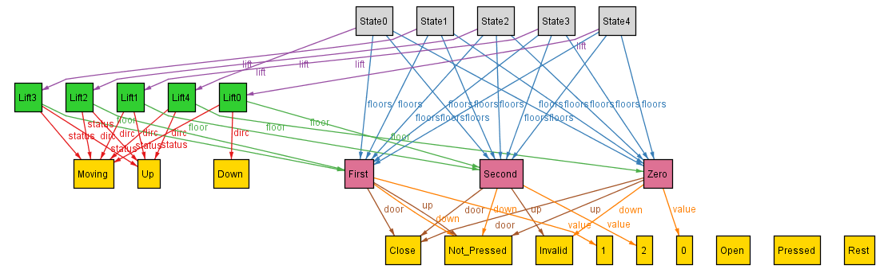
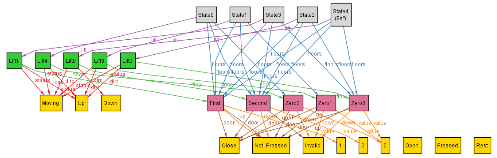
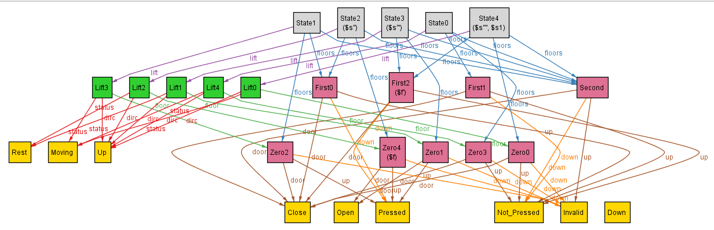

## Dynamics - Floor Buttons: Pressed/Not_Pressed

Now I work upon the dynamics of the floor buttons, which can be pressed or not_pressed.

For this, we would need to constrain the transitions in this manner:
```
// all f: s.floors, f1: s1.floors
if ( f.up = pressed and f1.up = not_pressed and f.value = f1.value ):
    // i.e. we want the pressed button to be unpressed only if the doors have just opened
    - f.door = Open and f1.door = Close
if ( f.down = pressed and f1.down = not_pressed and f.value = f1.value ):
    // i.e. we want the pressed button to be unpressed only if the doors have just opened
    - f.door = Open and f1.door = Close
if ( f.up = not_pressed and f1.up = pressed and f.value = f1.value ):
    // we don't want to constrain this, as the floor button can be pressed at any time
```

Upon implementing this and running with simply 'run{} for exactly 5 State, exactly 5 Lift, 15 Floor' to see the current working of my lift:



When we look at the above movement, everything seems fine at first, however on looking closely we can see that in the state3, the direction of the lift on Second floor is Up. Hence, I realise I had missed this border case while writing the up and down movement of the lift.

Current:
```
fact up {
    // specifying the case for the lift moving up
    all s: State - last, s1: s.next {
        // constraining that the next floor if has higher value than the current floor
        // then can go at max one floor up, as well as the motion is maintained
        ( s.lift.floor.value < s1.lift.floor.value ) =>
        {
            s1.lift.floor.value < s.lift.floor.value + 2
            s.lift.dirc = Up and s1.lift.dirc = Up
            s.lift.status = Moving and s1.lift.status = Moving
            s1.lift.pressed_buttons = s.lift.pressed_buttons
            s1.floors = s.floors
        }
    }
}
```

Now, in order to accomodate the border case, I replace the statement `s1.lift.dirc = Up` with `(s1.lift.floor.value = 2 => s1.lift.dirc = Down) and (s1.lift.floor.value != 2 => s1.lift.dirc = Up)` and similarly for the fact down{}.

Re-running the newly implemented code, we get:



Looking at this we can see the direction of the lift changes accordingly at the Second floor, however, we haven't yet tested for the floor_buttons getting pressed and unpressed, so let's test for it using:
```
	some s: State, f: s.floors | f in First and f.down = Pressed
    some s: State, f: s.floors | f in Zero and f.up = Pressed
	some s: State - last, s1: s.next | s.lift.floor.door = Open and s1.lift.floor.door = Close
```
Upon, adding these and running, we get:



This indicates that the floor buttons can be pressed at any time, as well as if they are pressed then they get not_pressed along with the closing door only. 
Hence, we have achieved the dynamics of the floor buttons.


