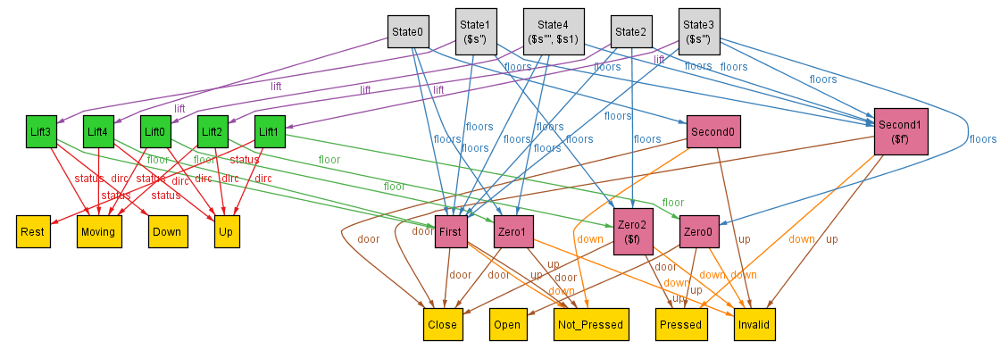

## Dynamics - Lift Dirc: Up/Down

Here we are looking to constrain the change in dirc of the lift. 

Normally this would also depend on the algorithm we use, however I have for now, made the assumption to go with basic sweep algorithm.

#### Basic Sweep Algorithm:

As the name suggests, we want to continue in a particular dirc of movement as long as there are floors in that dirc which we need to visit. If there are 
none, we switch the dirc and either continue movement or stop based upon whether there are floors in the new dirc to be reached.

```
if in motion:
    - continue that dirc of motion as long as there is a floor which you need to reach in that dirc
    if no floor in the dirc of motion:
        - change dirc of motion
        if no floor needed to reach in new dirc:
            - come to Rest
else:
    if some floor needed to reach:
        - move in that dirc
    else:
        - stay at Rest
```

Now, I had previously specified the dirc and status of the lift a bit randomly (set it to something such as when after the door closes). So herein, I'll work on the predicate for the dirc, status of the lift. Additionally, we would need to constrain the direction switches can occur only when the dorr of the lift just closes at a floor.

To constrain this we need to introduce:
```
// pseudocode
predicate (s,s1):
    if s.dirc = Up:
        if some floor above s.lift.floor in s.floors, which needs to be visited
            (i.e. in pressed_buttons or one of it's button is pressed):
            - s1.lift.dirc = Up and s1.lift.status = Moving
        elif some floor below s.lift.floor in s.floors, which needs to be visited
            (i.e. in pressed_buttons or one of it's button is pressed):
            - s1.lift.dirc = Down and s1.lift.status = Moving
        else: // None of the floors need to be visited
            - s1.lift.dirc = Up and s1.lift.status = Rest
    else:
        if some floor below s.lift.floor in s.floors, which needs to be visited
            (i.e. in pressed_buttons or one of it's button is pressed):
            - s1.lift.dirc = Down and s1.lift.status = Moving
        elif some floor above s.lift.floor in s.floors, which needs to be visited
            (i.e. in pressed_buttons or one of it's button is pressed):
            - s1.lift.dirc = Up and s1.lift.status = Moving
        else: // None of the floors need to be visited
            - s1.lift.dirc = Down and s1.lift.status = Rest
```

Using the above pseudocode, I implement all the if-elses in Alloy using implication. After which, I use this predicate to replace the dirc and status deciding policy which we had previously used in fact close_door{} and added a few statements in the fact to test the predicate:

```
    first.lift.status = Moving
    first.lift.dirc = Up
    first.lift.floor in First          // did to check the dircn switches
    some s: State, f: s.floors | f in Zero and f.up = Pressed 
    some s: State, f: s.floors | f in Second and f.down = Pressed
	some s: State - last, s1: s.next | s.lift.floor.door = Open and s1.lift.floor.door = Close
```
Upon running which I get:



In the above instance, we can see that:

State0 : Lift at First, Up, Moving <br>
State1 : Lift at First, Down, Moving 
- Zero now has Up button Pressed
- Second also now has Down button Pressed

State2 : Lift moves to Zeroth Floor, Up, Close <br>
State3 : Lift at Zero, Up, Open <br>
State4 : Lift at Zero, Up, Close <br>

Thus, we can clearly see our predicate wored fine as the 

