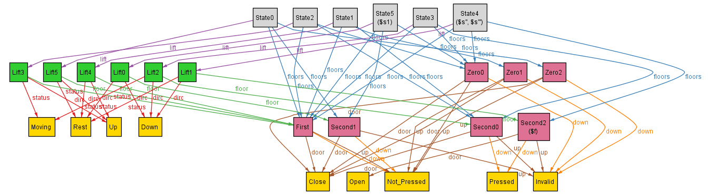

## Dynamics - starting from Rest

We have made quite some progress uptil here, however we haven't yet constrained the Lift to start moving on it's own i.e. I had only constrained that the Lift changes from Rest to Moving, when door closes.

However, here we shouldn't have used this condition as this presents a possibility of Lift never starting from rest.<br>
Say a lift was at rest on Zero floor, a button on Second floor is clicked, then the lift must transition to Moving in the next state. To implement this:
```
    // modifying the original condition of transition from rest to moving
    all s: State - last, s1: s.next {
        // constraining that if the lift was open then transition to the Moving state at the same time lift door closes
		( s.lift.status = Rest and s1.lift.status = Moving and s.lift.floor.door = Open ) =>
		( s1.lift.floor.door = Close )

        // and the predicate lift_dirc_status must be true
		(( s.lift.status = Rest and s1.lift.status = Moving and s.lift.floor.door = Close ) =>
		( lift_dirc_status [ s, s1 ] ))      
	}
```

Additionally, we must ensure that a stagnant lift the moment a button is pressed on any floor starts moving. For this:
```
// pseudocode
if s.lift.floor not in the floors to be visited and the door is closed and lift at rest:
	- lift_dirc_status [ s, s1 ] holds then, this will automatically give the if the lift has to move or not
```

Upon implementing this in Alloy and running the analyzer with the statements 
```
	first.lift.floor in First
	some s: State - last, s1: s.next | s.lift.floor.door = Open and s1.lift.floor.door = Close and s.lift.floor in Second
```
we get no satisfiable instances when ran for 5 states, however upon increasing the states to 6, we get:



As we can see, the lift starts from Rest, the moment a button on Second floor is pressed, the lift transitions to the moving stage in the next state. Then the lift opens, the pressed button gets unpressed and the lift closes.

Looks like we are nearing the end of this basic one lift system :)
