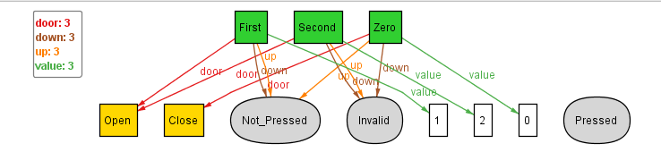

## Simplifying the Floor Sig

Now, to tackle the previous discussed problem of having to treat the floors seperately due to independent categorisation into 3 types, here, we shall by adding another state to Button sig -> Invalid. This Invalid state is used to signify that the button cannot be used. 

By using this we can generalise each floor having two buttons up and down. So, we initialise such an abstract sig, Floor, shall have a lift door, value, up button, down button. 

Now, the Floor sig is extended into three abstractions, Top_Floor, Middle_Floor, Bottom_Floor, which are further extended for Zero, First and Second respectively (3-Lift system). Additionally, we add facts to assign the up button of Top_Floor as Invalid and down button of Bottom_Floor as Invalid. Upon executing in alloy and executing we get:
```
	Top_Floor.up = Invalid
	Bottom_Floor.down = Invalid
```

  

### **Problem:**
In the above instance, we observe that the down button of the Second floor is getting instantiated as Invalid. However, the down button of the Second floor should be pressable.

Upon further checking more instances, we realize that **all the floor buttons** can take the **Invalid state**. However, this shouldn't be the case.
