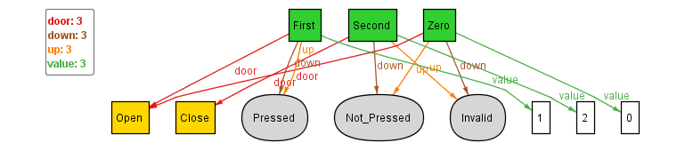

## Correcting the Floor Sig

Now, to tackle the previous discussed problem of observing even the pressable floor buttons taking the Invalid state, here, we recognize that we had added a new state Invalid which the Button sig can take and constraints where it should appear, however had added no new constraints upon where it cannot appear. Hence, even the buttons which weren't intended to be invalidated were taking the state Invalid.

To tackle this, we can simply add a few facts constraining where the Invalid state cannot appear:
```
	Middle_Floor.up != Invalid
	Middle_Floor.down != Invalid
	Top_Floor.down != Invalid
	Bottom_Floor.up != Invalid
```
Now, upon executing we get the following instance:

  

### **Conclusion:**
With this we wrap up the construction of a basic Floor sig, now we shall move on to defining the basic lift and it's specifications
