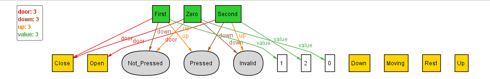
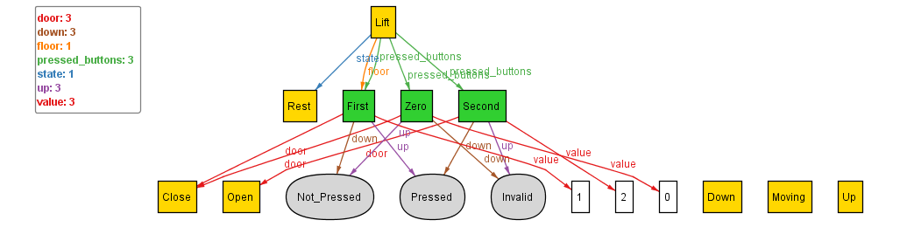

## Initialising the Basic Lift Sig

We have initialised the basic Lift signatures. A Lift sig shall have 3 main attributes:
- floor: necessary to store to determine the doors, lift movement
-`state: tells about whether the lift is moving or not
-	pressed_buttons: store the pressed_buttons inside the lift

For state, we can enum State as Moving or Rest. Upon implementing this, and instantiating we get:



Upon, which we realize we want to see some instance of Lift, and hence, run with next:
```
run{some Lift}
```


This is consistent with what we expected.
