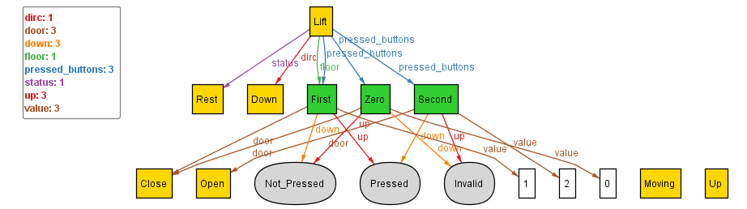

## Updating the Basic Lift Sig

Although we had initialized a basic lift sig, but when we think about it, we realize that lift doesn't change it's direction immediately, rather, in most of the Lift 
algorithms where starvation doesn't take place, lift maintains it's direction of movement. 

This further motivates us to store the direction within the Lift sig as well. For this we introduce _dirc_ with two states - up, down.

Upon executing after updating we get:

This seems consistent with what we wanted. Hence, can proceed to the next step to introduce ordering.
