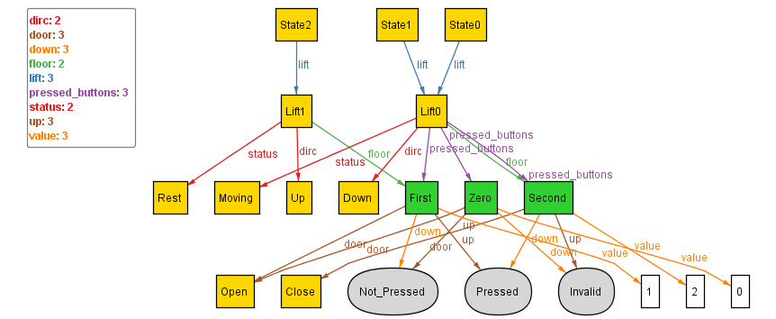
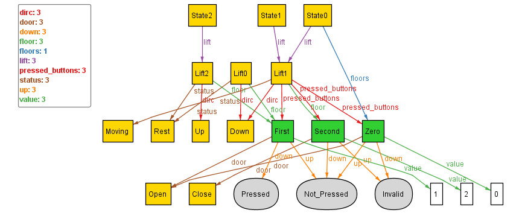

## Introducing ordering to the basic lift

Next, for any algorithm to function or the lift to move, we would want to introduce some form of ordering within various states of the lift. For this, we import an in-built module of alloy using:
```
open util/ordering[State]
```
where, we declare "State" to be used to define the information we want to store about the current situation of our model.

Then, we initialise the defination of "State" with a lift (since, single-lift system) and a set of all the floors.
Upon executing after initialising and modifying run{}, we get such satisfiable instances:



### Problem:
