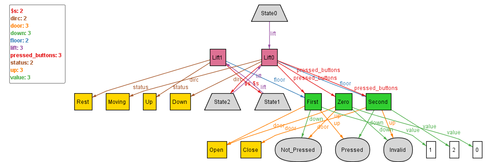

## Tackling problems - a lift should be mapped to some state

To tackle this problem, we introduce a new set of facts called, state_constraints, and add the constraint that ~ all Lifts which exist, must be mapped to some State :
```
fact state_constraints {
	 all l: Lift | ( some s: State | l in s.lift )
}
```
Upon executing, we get:



Observing this we can see that we have tackled the problem of lifts not being mapped successfully.
