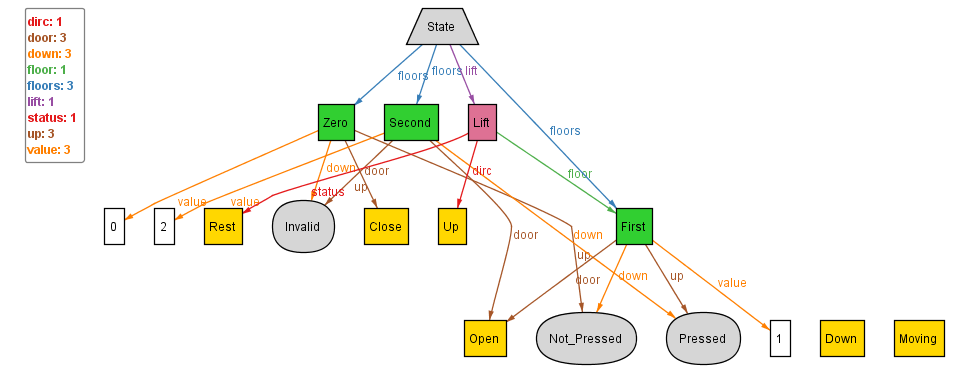
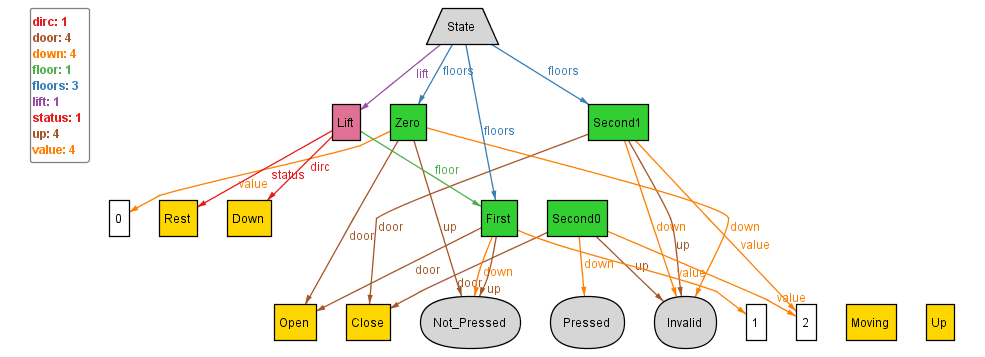
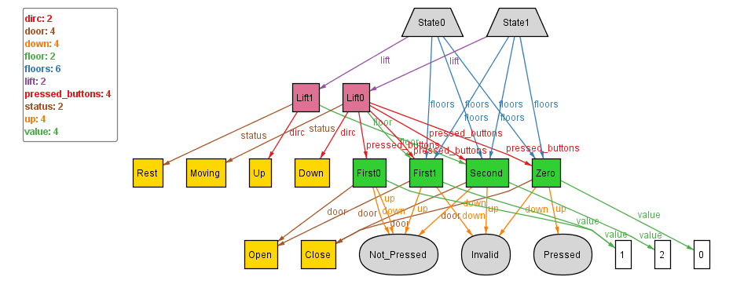
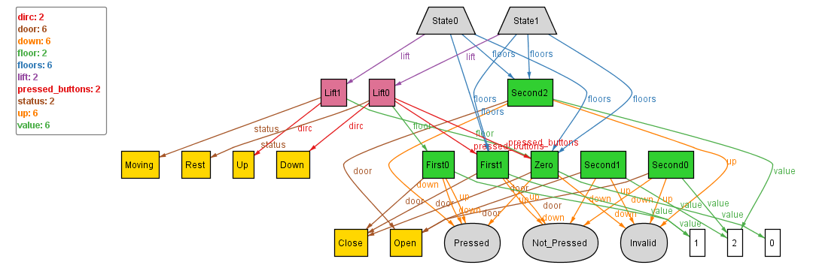

## Tackling problems - floors set mapped to a state should be complete

To tackle this problem, we add a new constraint to:
- fix the size of state.floors to 3
- ensure that each floor instance is included within this set
```
    all s: State | #s.floors = 3 and
    some f1:Zero | f1 in s.floors and
    some f2:First | f2 in s.floors and
    some f3:Second | f3 in s.floors
```
Now, we shall modify the run statement and execute it multiple times, to check:

1. <p>
```
run{} for 1 State, 1 Lift, exactly 3 Floor
```
 <br>
The above seems consistent with what we wanted. </p>

2. <p>
```
run{} for 1 State, 1 Lift, exactly 4 Floor
```
 <br>
A problem is spotted:
- Second0 state is existing on it's own which shouldn't be the case. A floor should only exist when it's mapped from something  ~ **#NEEDTOFIX - 1**<br> 
**Probable cause:** Haven't constrained that the floors cannot exist independently
Rest of the instance seems consistent. </p>

3. <p>
```
run{} for 2 State, 2 Lift, exactly 4 Floor
```
 <br>
A new problems is spotted:
- First0 state isn't pointed by any any state, however still exists within the pressed_buttons of Lift0 ~ **#NEEDTOFIX - 2**<br>
**Probable cause:** Haven't constrained that all the pressed_buttons of a lift must pt. to floors which can be mapped from the parent state of the lift
</p> 

4. <p>
```
run{} for 2 State, 2 Lift, exactly 6 Floor
```
 <br>
One new problem is spotted:
- the floor at which Lift0 is pointing to is First0, however this doesn't even exist inside the floors mapped to by it's parent state (State1) ~ **#NEEDTOFIX - 3**<br>
**Probable cause:** Haven't constrained that the floor at which lift is must pt. to a floor which is mapped from the parent state of the lift
</p> 

Additionally, on observing we notice that both the states are pointing to the same three floors only. This is the case with rest of the instances as well, however they should pt. to three floors of type Zero, One, Two, but those may not necessarily be the same ones.
Hence, this approach to fixing this doesn't work.
```
    all s: State | #s.floors = 3 and
    some f1:Zero | f1 in s.floors and
    some f2:First | f2 in s.floors and
    some f3:Second | f3 in s.floors
```
**Probable cause:** Alloy reads _"some f1:Zero | f1 in s.floors"_ as, there should be some unique f1 state of type Zero which is mapped as the floors of all the States. This constrains it to map all the States to the same three floors, if they can exist.

