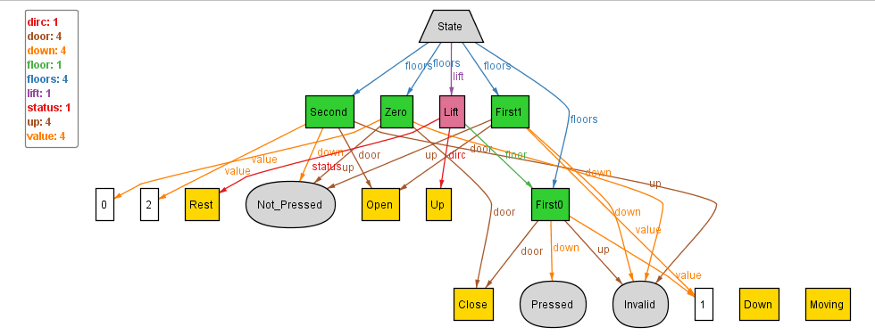

## Tackling NEEDTOFIX-1

We shall continue tackling the problem of floors set mapped to a state being complete later, but first shall tackle the NEEDTOFIXs one-by-one.

As stated in the previous version, we need to constrain that the floors don't exist independently (NEEDTOFIX-1).

For this we can simply add a fact constraining the floor to exist only if it is mapped to some State.floor :
```
	all f: Floor | (some s: State | f in s.floors)
```

Upon executing with run command - `run{} for 1 State, 1 Lift, exactly 4 Floor`, we get:



This seems consistent with what we  wanted, hence, can move forward to fixing NEEDTOFIX-2.

